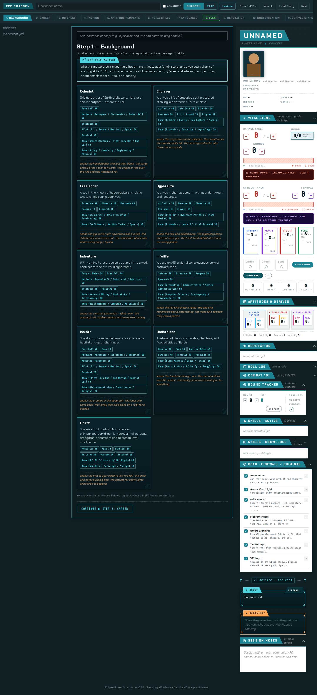
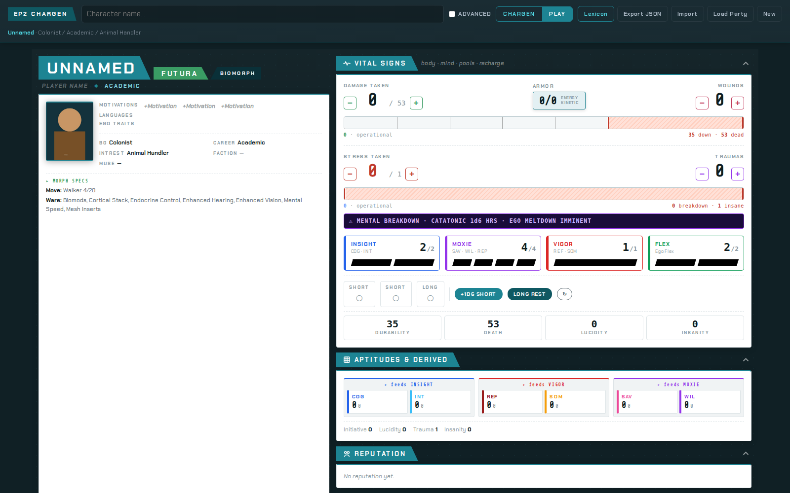
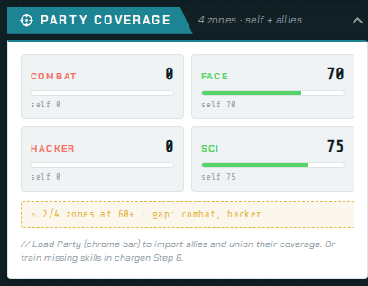

# Eclipse Phase 2 Character Creator

A single-file web app for building Eclipse Phase 2 characters and running them at the table.

**▶ Live at [ep2-chargen.vercel.app](https://ep2-chargen.vercel.app) — no install, no signup, works offline after first load.**



## What it does

- **13-step character creation wizard** following EP2's chargen procedure (book p.38–49). Lifepath (Background / Career / Interest / Faction) → Aptitudes → Skills → Languages → Reputation → Customization → Morph + Gear → Review.
- **Live character sheet** ("Studio" view): vital signs, pool meters, vitality / mind bars, aptitude strip, reputation, skills, gear — all derived in real time from your wizard choices.
- **Play mode**: toggle PLAY and the wizard hides entirely; the character sheet expands to full window. Turn Coach surfaces auto-applied modifiers (wounds × -10, traumas × -10, statuses), action economy (COMPLEX / QUICK / MOVE), and big-button rolls (ATTACK / DODGE / DODGE RANGED / PERCEIVE) with the modifiers pre-baked.
- **Full Attack Panel** with weapon picker, range / mode / aim / cover / ad-hoc modifier chips, live d100 target preview, and rolled-up DV computation.
- **Roll log** of the last 12 rolls with outcome badges (CRIT / WIN / FAIL / BOTCH) + MoS.
- **Party-coverage radar**: 4-zone (combat / face / hacker / sci) strategic readout, auto-computed from your skills + imported allies (Load Party).
- **Portrait upload** (drag-and-drop or click) with on-device JPEG downscale — stays in localStorage, never leaves your browser.
- **Lore-tab dossier voice** throughout: sci-fi sans (Chakra Petch) + terminal mono (Share Tech Mono) on dark teal panels with orange / cyan / green protruding monospace tabs.
- **Persistent**: every edit auto-saves to your browser's localStorage. Refresh and your character is still there. Export to JSON to share or back up.
- **Single file, no build**: the entire app is one `index.html` (~525KB). Open it in any browser. Self-host by serving it from anywhere. No npm, no bundler, no server required.



## Quick start

**Use it:** Open [ep2-chargen.vercel.app](https://ep2-chargen.vercel.app) and start building a character. State auto-saves to your browser.

**Self-host it:** Clone, then serve the directory with any static file server.
```bash
git clone https://github.com/Uploaded-Intelligence/eclipse-phase-2-chargen.git
cd eclipse-phase-2-chargen
python3 -m http.server 8000
# open http://localhost:8000
```

**Share with players:** Send them the live URL above. Their characters live in their own localStorage — independent of yours. They can export JSON when they're done and share the file with the GM.

**Run tests:** The artifact has 322 unit-test assertions across 7 suites covering schema migration, skill derivation math, deferred-field allocation, pool spend semantics, and roll mechanics.
```bash
for t in test-*.js; do node "$t"; done
```

## Why this exists

Built for a one-shot with artist players who'd never touched EP2 before — they needed something that:

1. Made character creation feel like a guided onboarding, not a tax form.
2. Gave them a live character sheet they could actually USE at the table without flipping between apps.
3. Looked like Eclipse Phase — transhumanist post-Fall sci-fi — not a corporate spreadsheet.

Each "Why this matters" callout in the wizard and each tooltip on a skill / aptitude / faction / morph is pedagogy as first-class affordance, not a help button buried in a corner.



## Status

Production. Shipping at version **0.5.3** as of 2026-05-16. Six months of iteration, eleven released waves. See [CHANGELOG.md](CHANGELOG.md) for the full evolution.

Known caveats:
- Sample characters from the EP2 corebook aren't pre-loaded — Load Party expects characters you've already exported.
- Async substrains (psi sleights) are present in tooltips but not in the full chargen flow yet.
- Resleeving mid-session (morph swap with state migration) isn't implemented — defer or restart for now.

## Contributing

PRs welcome — especially:
- More tests against `studioPcFromState()` and the chargen pipelines (we have a known gap here from v0.5.3)
- Bug reports with character JSON exports attached
- Translations
- More morph traits / ware tooltip data
- Print stylesheet for character-sheet hardcopy

The codebase is one `index.html` file deliberately. State management is a vanilla dispatch / rerender loop. All math is in the `derived` object. UI builders are flat `buildXxx(pc)` functions returning DOM trees via the tiny `h()` helper.

`MATH-SPEC.md` documents the skill-derivation math (slot allocations → buckets → effective values → CP bumps → 80-cap → surplus tracking). Read this before touching `finalSkills()`.

## License

This work is licensed under [Creative Commons Attribution-ShareAlike 4.0 International (CC BY-SA 4.0)](LICENSE) — matching the Eclipse Phase 2 SRD's own license. You can copy, remix, and redistribute, including commercially, as long as you credit and share-alike.

Eclipse Phase is the property of [Posthuman Studios LLC](https://eclipsephase.com/). The rules referenced in `RULEBOOK_REFERENCE.json` are from the Eclipse Phase 2 SRD, used under their CC-BY-SA license.

## Credits

Built by the Beworlding System with [Claude Code](https://claude.com/claude-code), [Claude Design](https://claude.com/claude-design) (visual direction), and Vercel (hosting). The wave-by-wave development arc is in [CHANGELOG.md](CHANGELOG.md).

If you use this for your table, let us know — and good gatecrashing.
